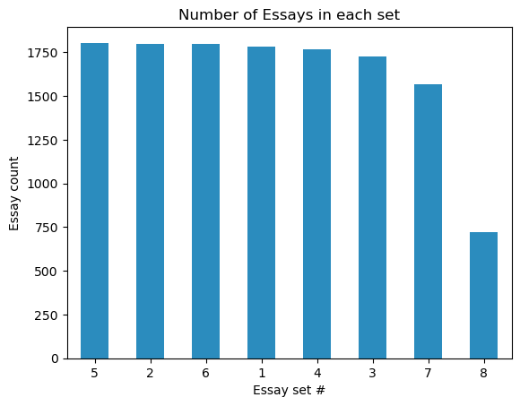
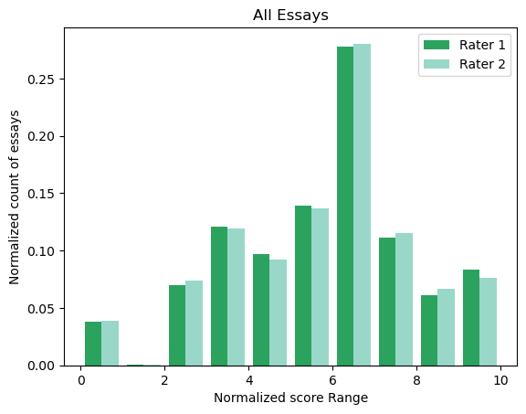
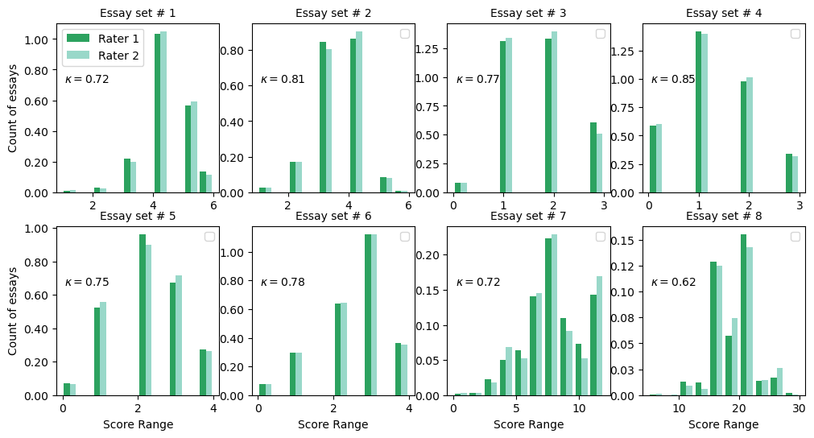

# Authomated Essay Scoring (AES) Using NLP

*Credits: ChatGPT*

## Business Understanding
Teaching students how to write well is essential since it enables them to convey their ideas in an effective manner and succeed in their personal/academic endevours [(McNamara, 2015)](https://www.sciencedirect.com/science/article/abs/pii/S1075293514000427). As such, writing exercises such as essays are powerful tools for evaluating and preparing students in this area. However, grading essays manually is time-consuming and expensive for states. As a result, educational institutions opt in for multiple-choice standardized tests instead [Ref](https://www.kaggle.com/competitions/asap-aes). Thus, developing high-fidelity automated essay scoring tools is of utmost importance.

## Data Understanding and Analysis

The dataset is from "The Hewlett Foundation: Automated Essay Scoring" competition on Kaggle ([Link](https://www.kaggle.com/competitions/asap-aes)). It contains manually-scored essays. The dataset contains 8 essay sets from students grade 7 to 10. On average, each essay is approximately 150 to 550 words in length. Each essay set, has its own prompt, rubric and score range. All essays are scored by two graders and at times of stark contrast between the two grades, a third professional grader has scored the essay. Except for essay set #2, all essays have a final score field that can be used as the target variable in this study. Essay set #2 was scored by graders in two different domains (in the original competition, it's asked that two different scores be outputted for this essay set). For simplicity, we only use the scores from domain one for this essay set in the present study. 

    
*Figure 1. Essay counts per set.* 

Since the score range for each essay set is different, to use all sets together for developing a model, we will normalize all scores to a range 0 to 10. The following shows the distribution of normalized scores for the two human raters that graded the essays by hand. 

    
*Figure 2. Distribution of hand-graded scores (normalized) for all essays.* 

The Cohen's kappa  (with quadratic weighting) can be used to compare how well the two human raters agree in order to create a benchmark for model's performance. 

*Figure 3. Agreement of human raters for each essay set.*

Aggregated Cohen's kappa for all essays is $0.75\pm0.07$.

## Feature Engineering
To build an automated essay scorer, relevant features must be extracted from essays. Coh-Metrix, a program that analyzes discourse using NLP, is commonly used for this purpose. Since Coh-Metrix lacks a Python implementation for English, this study computes similar features using the extract_features_bulk function. These features capture essay characteristics such as text easability, cohesion, lexical diversity, connectivity, syntactic complexity, and readability. The following table outlines these features.
| Feature Name             | Explanation                                                                                          |
|--------------------------|------------------------------------------------------------------------------------------------------|
| num_words                | The total number of words in the essay. It provides an overall measure of essay length.              |
| num_sentences            | The total number of sentences in the essay. This is an indicator of the essay's structure.            |
| avg_sentence_length      | The average number of words per sentence. It gives an indication of sentence complexity.              |
| std_sentence_length      | The standard deviation of sentence lengths. This shows the variability in sentence structure.         |
| avg_syllable_count       | The average number of syllables per word. It reflects the complexity and sophistication of the words. |
| std_syllable_count       | The standard deviation of syllable counts across words. This shows the variation in word complexity.  |
| avg_letter_count         | The average number of letters per word. It gives an idea of word length and lexical richness.         |
| std_letter_count         | The standard deviation of letter counts per word. This measures the variability in word length.       |
| flesch_reading_ease      | A readability score indicating how easy the text is to read. Higher scores indicate easier readability.|
| flesh_kincaid_grade      | A grade-level readability score. This indicates the U.S. school grade level required to understand the text.|
| smog_index               | A readability measure based on sentence length and complex words. It provides a gauge of readability difficulty.|
| lexical_diversity        | The ratio of unique words to total words. Higher values suggest a richer vocabulary.                  |
| num_stopwords            | The proportion of stopwords in the text. A high proportion may indicate simpler language use.        |
| num_pronouns             | The proportion of pronouns in the text. This can give insights into the personal style of the writer. |
| num_verbs                | The proportion of verbs in the text. This can indicate the action-oriented nature of the text.        |
| avg_tree_depth           | The average syntactic depth of words in the sentence. A measure of sentence complexity from a syntactic perspective. |
| avg_concreteness         | The average concreteness of the words. Concreteness correlates with the level of abstraction in the text.|
| num_misspelled           | The proportion of misspelled words. This may indicate the writer's attention to spelling or errors.    |
| lsa_overlap_avg          | The average overlap in meaning between adjacent sentences, measured using Latent Semantic Analysis.    |

The final dataset has roughly 13000 entries and 20 features (including the essay set).

## Machine Learning Model
Various algorithms have been used for automated essay scoring (AES), including Linear Regression, Random Forest Regressor, and Linear Support Vector Regressor. While hierarchical classification and transformer models have shown promise, this project uses a Random Forest Regressor due to its strong performance and ability to handle both numerical and categorical features. Although fine-tuning a transformer model was considered, it was deemed time-prohibitive for this project.

A pipeline was developed for cross-validation and hyperparameter tuning, with mean squared error as the evaluation metric. Since scores were originally ordinal but normalized to a continuous scale, a denormalization step was applied to map predictions back to the original scale. Model performance was assessed using Cohen's kappa with quadratic weighting, achieving a high agreement of **0.98** with human raters.

## Results and Recommendations
1. The cross-validated and test mean squared error of the model are close to 2 (units: normalized score).
2. The best-fit model has an $R^2$ of 0.68. This means that the model explains only 68% of the variability in the target variable (normalized scores). Although $R^2$ matters more for inferential modeling, a moderately high $R^2$ can still yield a strong predictive model.
3. The random forest regressor achieved a high Cohen's kappa score, 0.98. We note that quadratic weighting is being used (per the Kaggle competition's instructions). 

## Limitations and Next Steps
1. The model is doing well overall. We note a minor difference between the current study and the actual instructions included for the competition. In the actual Kaggle competition, the validation and test sets are provided separately (the test set is actually not provided; it is only used to evaluate the final models). In the current study, we're using the actual train set provided to make our own validation and test sets. This is not problematic per se, but is worth noting. 
2. While the current model has a high performance (a quadratic kappa score of 0.98, which is greater than the human raters' agreement), exploring transformer models or hierarchical models may be worth due to their strength in not only grading the essays but also identifying the levels at which essays may be lacking. This will provide a good platform for providing students with constructive feedback. 

## Resources
- Data: [Link](https://www.kaggle.com/competitions/asap-aes)
- Jupyter Notebook: [Link](https://github.com/setare92-ha/education_early_intervention/blob/main/main.ipynb)
- Presentation: WIP
## Navigating the Repository
├───.gitignore  
├───feature_engineered_data.csv 
├───training_set_rel3.tsv 
├───main.ipynb 
├───README.md 
├───images 
└───src 
    │   feature_engineering.py 
    │   post_processing.py 
    │   preprocessing.py 
    │   visualizations.py 
└───presentation.pdf 

